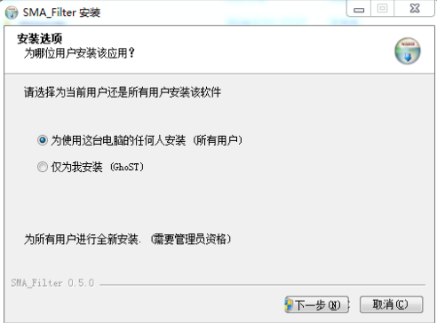
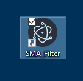
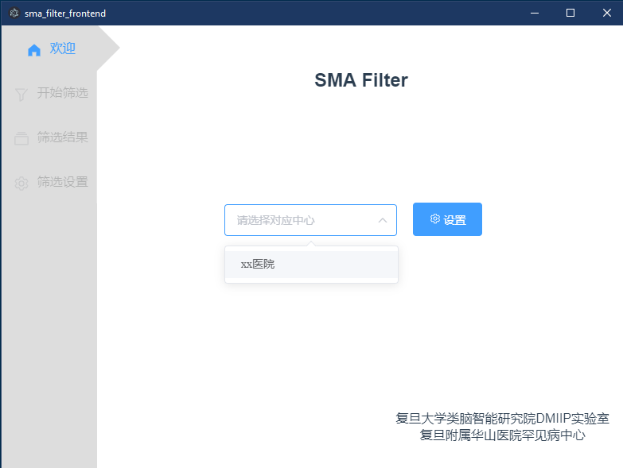
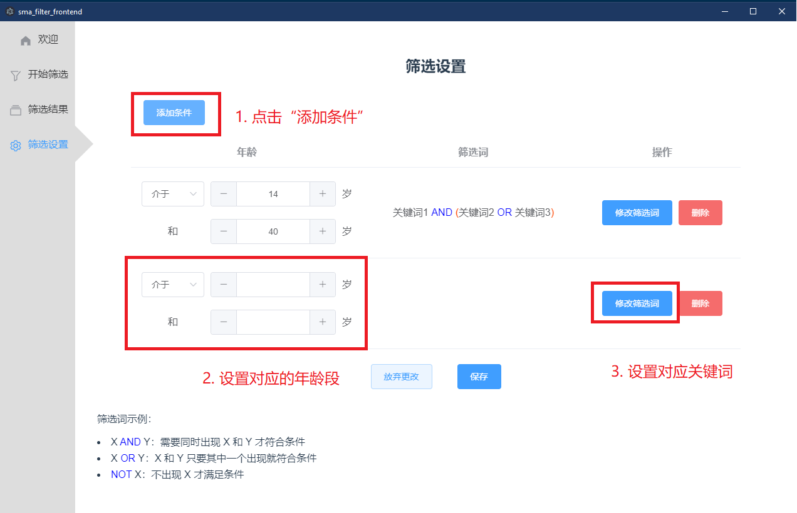

<h1>SMA Filter 使用说明</h1>

### 1. 安装

1. 打开安装程序

2. 选择安装的用户。
   - 若选择“所有用户”，需要管理员权限安装
   - 若选择“仅为我安装”，则无法安装在`C:\Program Files`或`C:\Program Files (x86)`等系统目录下，因为这些地方需要管理员权限才能访问

3. 可根据需求修改安装位置，然后点击“安装”

4. 安装完成后可直接启动，也可在桌面上找到对应图标，双击即可启动

### 2. 初次使用

1. 开启后会进行初始化，请耐心等待

2. 如果提示防火墙拦截，请允许访问。这里不会涉及敏感数据泄露，也不会访问外网。如果不放心，可以在断开网络连接后筛选。

   

3. 如果提示“读取失败”或初始化很长时间（超过10秒），可能是被防火墙拦截了。可以打开控制面板，依次选择“系统和安全 - Windows防火墙 - 允许的程序”，勾选`java.exe`

   

4. 首次使用时，需要导入对应的筛选词设置文件，步骤如下：

### 3. 正常使用

1. 在“欢迎”页面选择对应的医院或中心

2. 在“开始筛选”界面选择病例所在文件夹，并开始筛选。

3. 筛选过程中可实时查看进度，也可中止筛选

4. 在“筛选结果”中查看处理结果。<u>**注意：结果会自动保存，下次打开仍能看见。新的筛选结果会覆盖旧的结果，请及时使用“一键保存”导出病例文件**</u>

### 4. 设置筛选词

**在导入之后，会自动完成筛选词设置。如果未来有修改筛选词的需求，可参照以下步骤进行修改**

1. 打开“筛选设置”页面

2. 如需要添加新的年龄分组和对应条件，可点击左上角“添加条件”

3. 关于筛选词：需要输入筛选的逻辑。例如下图中，只有三种情况会被认为存在SMA风险，分别是：

   - 出现 <u>关键词1</u> 和 <u>关键词3</u>
   - 出现 <u>关键词1</u> 和 <u>关键词2</u>
   - 出现 <u>关键词1</u>  <u>关键词2</u> 和 <u>关键词3</u>

   除了这三种情况，其他的会被认为没有SMA风险。例如只出现 <u>关键词1</u> ，不符合筛选要求。

   此外，关键词的出现顺序不会造成影响。

4. 修改后，需要进行保存。

